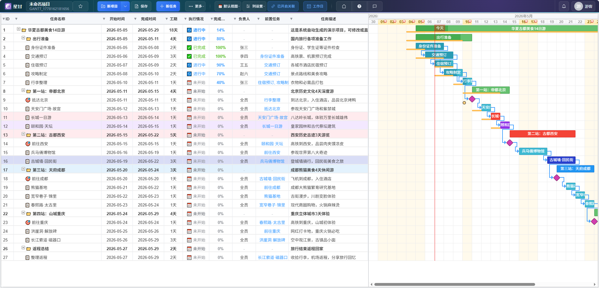
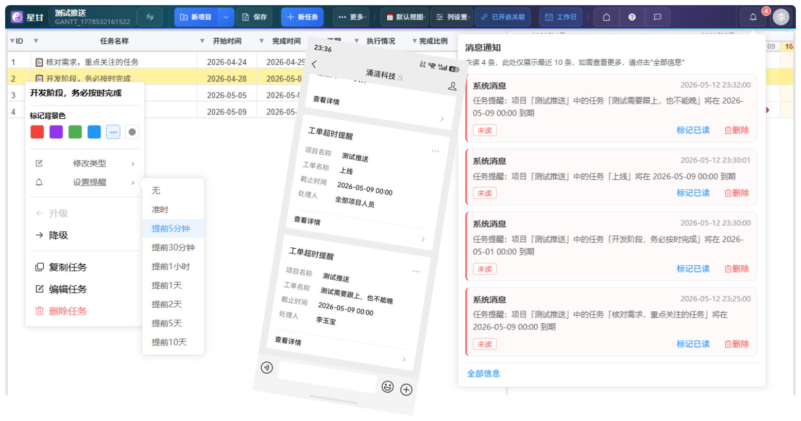
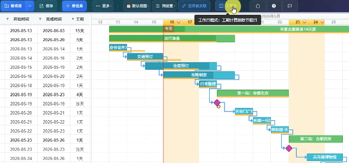
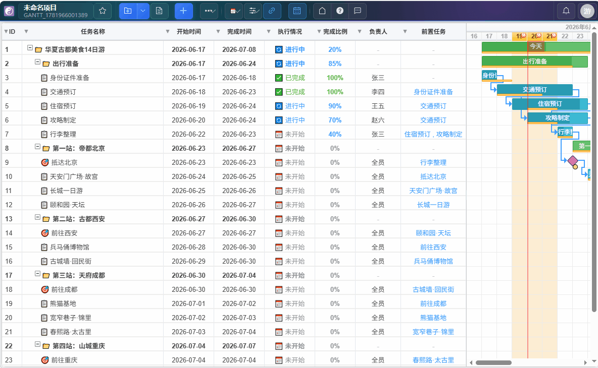
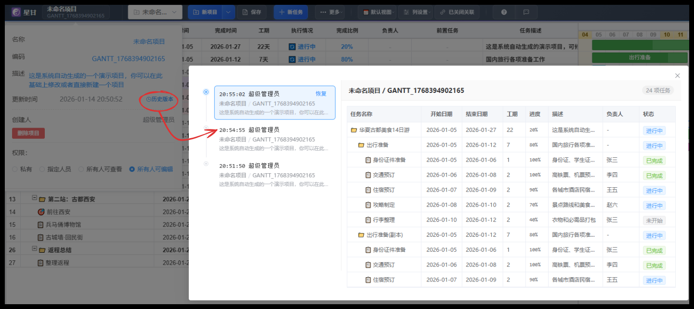

<div align="center">
  <h1>☯️ StarGantt 星甘</h1>
  <p>开源免费的在线甘特图制作平台</p>
  
  [](https://www.gnu.org/licenses/old-licenses/gpl-2.0.en.html)
  [](https://vuejs.org/)
  [](https://element-plus.org/)

  [官方网站](http://stargantt.cn) · [报告问题](https://gitee.com/yubaolee/StarGantt/issues) · [功能建议](https://gitee.com/yubaolee/StarGantt/issues)
</div>

---

## 📖 简介

StarGantt（星甘）是一款基于 Vue3 + Element Plus 开发的专业项目进度管理工具，致力于打造开源免费的在线甘特图制作平台。无论你是项目经理、产品经理，还是需要管理个人项目的自由职业者，StarGantt 都能为你提供专业、直观的项目可视化管理体验。












## ✨ 核心特性

### 任务与计划管理

- **任务依赖管理**：支持前置任务设置，涵盖 FS（完成-开始）、SS（同时开始）、FF（同时完成）、SF（开始-完成）、无约束 5 种依赖类型。开启关联后，调整任务时间时前置和后续任务自动级联调整。
- **设置基线**：支持设置基线，随时查看实际进度与原始计划的差异。
- **状态管理**：支持未开始、进行中、已完成、已暂停、已取消等多种任务状态。
- **任务分组**：支持父任务和子任务的层级结构。
- **多视图模式**：支持小时视图、日视图、周视图、月视图、季度视图，满足不同项目周期需求。
- **节假日识别**：自动判断节假日并在甘特图中标识，排期更精准。

### 操作与交互

- **拖拽操作**：拖拽调整任务时间、重新排序，操作简单直观。
- **列宽拖拽**：直接拖拽表头边缘调整列宽，支持拖拽甘特图左侧表格区域与右侧时间轴区域的分界线。
- **自定义列**：灵活的列设置，可增加自定义列（如优先级、重要性、完成说明等），并能随时查看/隐藏/调整顺序。
- **表头筛选**：按列多选筛选、关键词快速定位，支持全选、反选与清空操作。
- **背景色标记**：支持任务背景任意颜色自定义，方便快速识别任务状态。
- **一键复制**：基于已有项目，一键复制成新项目。

### 数据与导入导出

- **数据导出**：支持导出带甘特图的 Excel 格式，方便汇报和备份；支持高清图片导出。
- **Excel 导入**：双模式导入——AI 智能识别任意格式 Excel 自动生成甘特图，或星甘格式直读（纯本地解析，不上传服务器）。
- **AI 智能生成**：输入项目描述文本，AI（基于 DeepSeek）自动分析生成完整甘特图任务计划，含任务层级与依赖关系。

### 协作与团队

- **权限控制**：支持项目所有人只读、所有人编辑、指定人员编辑和私有模式。
- **任务到期提醒**：9 个提醒时间档位（准时至提前 10 天），站内消息 + 微信公众号双通道推送。
- **多项目驾驶舱**：汇总多个项目的关键节点、风险任务，智能识别里程碑和交付节点。
- **资源视图**：按成员统计工作量与任务推进情况，支持工时预警和完成率查看，含"仅任务模式"。
- **自动保存**：检测到数据变化时自动保存，减少忘记保存导致的数据丢失。
- **项目归档**：已完结项目归档收纳，保持项目列表清爽，随时可恢复。

### 系统与部署

- **主题切换**：默认、明亮、灵动岛、流光溢彩等多主题，配置跟随账号保存。
- **代码开源**：前端代码开源（GPL-2.0 协议），支持二次开发。
- **私有部署**：支持私有化部署，保证数据安全。后端提供Java Spring Boot及.Net两大开发平台，支持 MySQL 等数据库。

## 🚀 快速开始

### 环境要求

- Node.js >= 16.0.0
- npm >= 7.0.0

### 安装

```bash
# 克隆项目
git clone https://gitee.com/yubaolee/StarGantt.git

# 进入项目目录
cd StarGantt

# 安装依赖
npm install
```

### 开发

```bash
# 启动开发服务器
npm run dev

# 访问 http://localhost:3000
```

### 构建

```bash
# 构建生产环境
npm run build
```

## 🛠️ 技术栈

- **前端框架**: [Vue 3](https://vuejs.org/) - 渐进式 JavaScript 框架
- **UI 组件库**: [Element Plus](https://element-plus.org/) - 基于 Vue 3 的组件库
- **甘特图引擎**: [DHTMLX Gantt](https://dhtmlx.com/docs/products/dhtmlxGantt/) - 专业的甘特图库
- **状态管理**: [Pinia](https://pinia.vuejs.org/) - Vue 官方推荐的状态管理库
- **路由管理**: [Vue Router](https://router.vuejs.org/) - Vue 官方路由解决方案
- **HTTP 客户端**: [Axios](https://axios-http.com/) - 基于 Promise 的 HTTP 库
- **日期处理**: [Day.js](https://day.js.org/) - 轻量级日期处理库
- **Excel 导出**: [SheetJS](https://sheetjs.com/) - 强大的 Excel 处理库
- **构建工具**: [Vite](https://vitejs.dev/) - 下一代前端构建工具

## 📦 项目结构

```
StarGantt/
├── public/                 # 静态资源
│   ├── favicon.ico
│   └── ...
├── src/
│   ├── api/               # API 接口定义
│   ├── components/        # 公共组件
│   │   ├── GanttChart.vue    # 甘特图核心组件
│   │   ├── LoginModal.vue    # 登录模态框
│   │   └── ...
│   ├── router/            # 路由配置
│   ├── stores/            # Pinia 状态管理
│   ├── services/          # 业务服务层
│   ├── utils/             # 工具函数
│   ├── styles/            # 全局样式
│   ├── views/             # 页面视图
│   ├── App.vue            # 根组件
│   └── main.js            # 入口文件
├── index.html             # HTML 模板
├── vite.config.js         # Vite 配置
├── package.json           # 项目依赖
└── README.md              # 项目文档
```

## 📝 使用场景

StarGantt 适用于多种项目管理场景：

1. **软件开发项目** - 需求分析 → 设计 → 开发 → 测试 → 上线的完整流程管理
2. **产品规划** - 产品路线图、功能迭代计划、发布时间规划
3. **活动策划** - 从前期准备到活动执行的全流程规划
4. **工程项目** - 建筑、装修等需要严格时间控制的项目
5. **学习计划** - 考研、考证等长期学习目标的时间规划
6. **个人事务** - 旅行规划、婚礼筹备等个人项目管理

## 🤝 贡献指南

我们欢迎所有形式的贡献，包括但不限于：

- 🐛 报告 Bug
- 💡 提出新功能建议
- 📝 改进文档
- 🔧 提交代码修复或新功能

### 贡献流程

1. Fork 本仓库
2. 创建新的功能分支 (`git checkout -b feature/AmazingFeature`)
3. 提交你的更改 (`git commit -m 'Add some AmazingFeature'`)
4. 推送到分支 (`git push origin feature/AmazingFeature`)
5. 提交 Pull Request

## 📄 开源协议

本项目采用 [GPL v2.0](./LICENSE) 协议开源。

## 🔗 相关链接

- [星甘官网](http://stargantt.cn)
- [Vue 3 官方文档](https://vuejs.org/)
- [Element Plus 官方文档](https://element-plus.org/)

## 💬 联系我们

如有任何问题或建议，欢迎通过以下方式联系我们：

- 提交 [Issue](https://gitee.com/yubaolee/StarGantt/issues)
- 访问我们的 [官网](http://stargantt.cn)

---

<div align="center">
  Made with ❤️ by StarGantt Team
</div>
